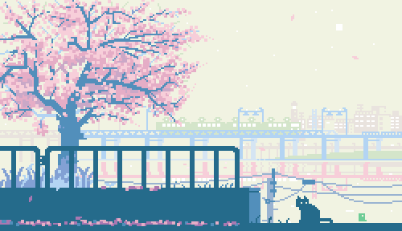

<h1 align="center">
    
</h1>

    

        
    

    

        
    

### About me:

- 🎓 I'm a student at FPT University Quy Nhơn AI Campus.

- 🔮 I want to become a software engineer.

- ❤️ Coding, writing novels, listening to EDM, and anything about code.

- 🔭 I’m currently learning **Spring Framework**

- 💬 Ask me about **c, c++, java**

- 📫 How to reach me **hardingadonis@gmail.com**

### Connect with me:

	

		
		
		
	

### My Github stats:

	<picture>
		<source srcset="https://github-readme-stats.vercel.app/api?username=hardingadonis&hide=contribs&theme=dark" media="(prefers-color-scheme: dark)"/>
		<source srcset="https://github-readme-stats.vercel.app/api?username=hardingadonis&hide=contribs&theme=light" media="(prefers-color-scheme: light)"/>
		
	</picture>
	<picture>
		<source srcset="https://github-readme-stats.vercel.app/api/top-langs/?username=hardingadonis&layout=compact&hide=html%2Ccss&theme=dark" media="(prefers-color-scheme: dark)"/>
	<source srcset="https://github-readme-stats.vercel.app/api/top-langs/?username=hardingadonis&layout=compact&hide=html%2Ccss&theme=light" media="(prefers-color-scheme: light)"/>
	
	</picture>

### Support me:

	
	

